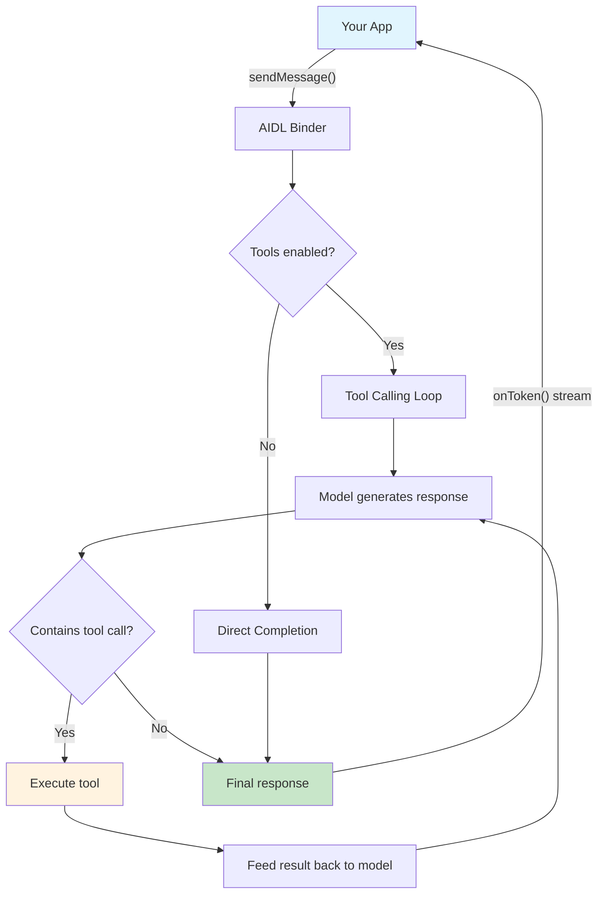
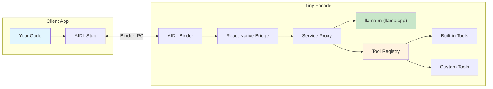
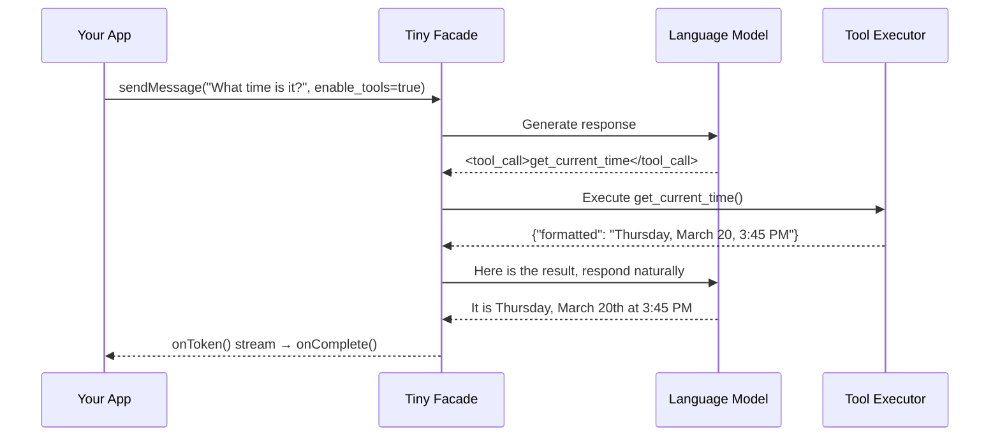

# Tiny Facade

**On-device AI inference as an Android service.** Any app can bind to Tiny Facade and run a local language model — no cloud, no API keys, no internet required.

Tiny Facade loads [GGUF](https://huggingface.co/docs/hub/gguf) models via [llama.cpp](https://github.com/ggerganov/llama.cpp) and exposes them over Android's [AIDL](https://developer.android.com/develop/background-work/services/aidl) interface. Think of it as a **local AI API server** that runs as a background service on your phone.

## Resources

| Resource | Link |
|----------|------|
| Tool Calling Modified GGUFs | [Hugging Face Collection](https://huggingface.co/collections/Bronsn/tiny-facade-multilingual-tool-calling-models) |
| Tiny Facade + AIDL Client Code | [GitHub — BakungaBronson/TinyFacade](https://github.com/BakungaBronson/TinyFacade) |
| Claude Code Plugin | [GitHub — BakungaBronson/tinyfacade-plugin](https://github.com/BakungaBronson/tinyfacade-plugin) |
| Linga App | [GitHub — Gimmyalex/linga](https://github.com/Gimmyalex/linga) |

## What It Does

```
┌──────────────┐        AIDL (IPC)        ┌──────────────┐
│  Your App    │ ◀──────────────────────▶ │ Tiny Facade  │
│              │   tokens stream back     │  (service)   │
│  "What time  │                          │              │
│   is it?"    │                          │  🧠 llama.cpp│
└──────────────┘                          └──────────────┘
```

- **Your app** sends a message (like a chat API)
- **Tiny Facade** runs inference on the loaded model
- **Tokens stream back** in real-time — you see the AI "typing"
- **Tool calling** lets the model execute actions (HTTP requests, file I/O, device info) and respond with real data

## How It Works



## Quick Start

### 1. Install Tiny Facade

Build from source or grab the APK from [Releases](../../releases):

```bash
git clone https://github.com/BakungaBronson/TinyFacade.git
cd TinyFacade/android
./gradlew assembleRelease
adb install -r app/build/outputs/apk/release/app-release.apk
```

### 2. Add a Model

Copy any GGUF model to your device:

```bash
adb push my-model.gguf /sdcard/Android/data/com.tinyfacade/files/
```

### 3. Open the App

Launch Tiny Facade, select your model, and it loads automatically. The AIDL service starts in the background.

### 4. Connect From Your App

Copy the AIDL files to your project and bind:

```kotlin
val intent = Intent("com.tinyfacade.INFERENCE_SERVICE")
    .setPackage("com.tinyfacade")
bindService(intent, connection, Context.BIND_AUTO_CREATE)
```

See the full [SDK documentation](docs/sdk/README.md) for complete integration instructions.

## Claude Code Plugin

If you use [Claude Code](https://claude.ai/claude-code), install the **TinyFacade plugin** to get AI-assisted scaffolding and integration help:

```bash
git clone https://github.com/BakungaBronson/tinyfacade-plugin.git ~/.claude/tinyfacade-plugin
~/.claude/tinyfacade-plugin/install.sh
```

Or test locally without installing:

```bash
claude --plugin-dir /path/to/tinyfacade-plugin
```

This gives you 5 skills:

| Skill | What it does |
|-------|-------------|
| `/tinyfacade` | Get started — overview, architecture, prerequisites |
| `/tinyfacade-scaffold [pkg] [name]` | Generate a complete client project (AIDL, Gradle, Activity, layout) |
| `/tinyfacade-connect [pkg]` | Add TinyFacade integration to an existing project |
| `/tinyfacade-tools [name] [type]` | Generate custom tool registration code |
| `/tinyfacade-troubleshoot [issue]` | Debug binding, models, performance, tools, signing issues |

Plugin repo: [github.com/BakungaBronson/tinyfacade-plugin](https://github.com/BakungaBronson/tinyfacade-plugin)

## Architecture



### Key Components

| Component | What it does |
|-----------|-------------|
| **InferenceService** | Android foreground service — the AIDL endpoint clients bind to |
| **Service Proxy** | Routes external requests to the local model, handles tool calling orchestration |
| **llama.rn** | React Native bindings for llama.cpp — loads GGUF models and runs inference |
| **Tool Registry** | Manages built-in and custom tools, dispatches execution |
| **Action Executor** | Runs tool actions (HTTP, file I/O, system queries) with sandboxed execution |

## Tool Calling

The model can use tools to get real data before responding. Your app doesn't need to manage any of this — just set `enable_tools: true`.

### How Tool Calling Works



Your app never sees the internal tool loop — just streamed tokens and a final natural-language response.

### Built-in Tools

| Tool | Description |
|------|-------------|
| `get_current_time` | Current date/time with timezone support |
| `get_device_info` | Device platform, OS version |
| `calculate` | Safe math expression evaluation |
| `search_contacts` | Contact lookup (mock data) |
| `get_calendar_events` | Upcoming events (mock data) |

### Custom Tools

Apps can register custom tools over AIDL. Tools use **action-based execution** — no arbitrary code runs on the host device.

```kotlin
// Register a weather tool that calls wttr.in
val definition = """
{
  "type": "function",
  "function": {
    "name": "get_weather",
    "description": "Get current weather for a city",
    "parameters": {
      "type": "object",
      "properties": {
        "city": { "type": "string", "description": "City name" }
      },
      "required": ["city"]
    }
  }
}"""

val action = """
{
  "type": "http",
  "config": {
    "method": "GET",
    "url_template": "https://wttr.in/{{city}}?format=j1",
    "timeout_ms": 10000
  }
}"""

service.registerTool(definition, action)
```

Now ask "What's the weather in Tokyo?" with tools enabled — the model calls the API and responds with real weather data.

### Action Types

| Type | Status | What it does |
|------|--------|-------------|
| `http` | Working | HTTP requests with `{{param}}` URL/body templates |
| `file` | Working | Read/write/list/exists — sandboxed to `tinyfacade-tools/` |
| `system` | Partial | `device_info` works; battery/network/location are stubbed |
| `intent` | Stubbed | Android Intent dispatch (needs native module) |
| `content_resolver` | Stubbed | ContentResolver queries (needs native module) |

## AIDL Interface

### IInferenceService

```java
interface IInferenceService {
    void loadModel(String path, in Bundle params, IInferenceCallback callback);
    void sendMessage(String messagesJson, in Bundle params, IInferenceCallback callback);
    boolean isModelLoaded();
    void stopGeneration();
    void releaseModel();
    List<String> getAvailableModels();
    String getLoadedModelPath();

    // Tool calling
    String getAvailableTools();
    boolean registerTool(String toolDefinitionJson, String actionJson);
    boolean unregisterTool(String toolName);
}
```

### IInferenceCallback

```java
oneway interface IInferenceCallback {
    void onToken(String token);          // Each generated token
    void onComplete(String response, String timingsJson);  // Generation done
    void onError(String message);        // Something went wrong
    void onModelLoaded(boolean success); // Model load result
}
```

### sendMessage Parameters (Bundle)

| Parameter | Type | Default | Description |
|-----------|------|---------|-------------|
| `n_predict` | int | 512 | Max tokens to generate |
| `temperature` | float | 0.7 | Sampling temperature (higher = more creative) |
| `top_p` | float | 0.9 | Top-p nucleus sampling |
| `stop_sequences` | String | `"[]"` | JSON array of stop strings |
| `enable_tools` | boolean | false | Enable tool calling orchestration |

## Test Client

The `test-client/` directory contains a standalone Android app that exercises the full AIDL interface.

### Build & Install

```bash
# Main app (install first — it hosts the service)
cd android && ./gradlew assembleRelease
adb install -r app/build/outputs/apk/release/app-release.apk

# Test client
cd ../test-client && ../android/gradlew assembleRelease
adb install -r build/outputs/apk/release/tinyfacade-test-client-release.apk
```

### What the Test Client Can Do

| Button | Action |
|--------|--------|
| **Bind** | Connect to the Tiny Facade service |
| **Load** | Load the selected GGUF model |
| **Send** | Send the prompt for inference |
| **Stop** | Cancel generation mid-stream |
| **Release** | Free model memory |
| **Unbind** | Disconnect from the service |
| **Enable Tools** | Toggle tool calling on/off |
| **Tools** | Query and log all available tools |
| **Register** | Register a sample weather tool (wttr.in) |

## Project Structure

```
TinyFacade/
├── android/                    # Android native (Kotlin)
│   └── app/src/main/
│       ├── aidl/com/tinyfacade/ # AIDL interface definitions
│       └── java/com/tinyfacade/ # Service, bridge, model holder
├── src/                        # React Native (TypeScript)
│   ├── hooks/
│   │   ├── useLlama.ts         # Model loading & basic inference
│   │   ├── useToolCalling.ts   # In-app tool calling (thin wrapper)
│   │   └── useServiceProxy.ts  # AIDL → tool loop orchestration
│   ├── utils/
│   │   ├── runToolCallingLoop.ts  # Shared multi-turn tool loop
│   │   ├── toolRegistry.ts     # Tool registration & dispatch
│   │   ├── actionExecutor.ts   # HTTP/file/system action runner
│   │   └── toolExecutor.ts     # Built-in tool implementations
│   ├── types/                  # TypeScript type definitions
│   └── native/
│       └── InferenceService.ts # Native module bridge
├── test-client/                # Standalone AIDL test app (Kotlin)
├── docs/sdk/                   # Client SDK docs + sample client
└── ios/                        # iOS target (not actively developed)
```

## Security

The AIDL service is protected by a **signature-level permission**. Only apps signed with the same certificate as Tiny Facade can bind to the service.

For development, both apps use the default debug keystore — no extra setup needed.

## Requirements

- Android 8.0+ (API 26)
- ARM64 device (`arm64-v8a`)
- A GGUF model file on the device

## Versioning

This project uses [Semantic Versioning](https://semver.org/). See [Releases](../../releases) for pre-built APKs.

## License

MIT
